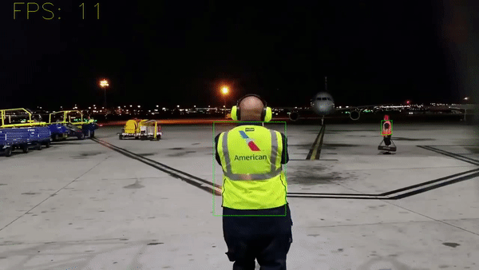

# Retinanet trained model  

# Person detection + color detection

<br/><br/><br/><br/>
# Setting up training

## Clone keras-retinanet repo in ~/safety_vests_detection (folder of current repo):<br/>
'git clone https://github.com/fizyr/keras-retinanet.git'


```console
change list of classes in /keras-retinanet/keras_retinanet/preprocessing/pascal_voc.py
```

```python

voc_classes = {
    'safety_vest' : 0
}
```

```console
cd ./keras-retinanet/
python3 setup.py build_ext --inplace
```
<br/><br/>
# Train the model

### download PlumsVOC folder from https://drive.google.com/file/d/11BetQCcj8z0KIhNSeOrB_gKkkq47A4ki/view?usp=sharing and place it in this repo

## Make directory to save the snaphots: <br/>
```console
mkdir -p TrainingOutput/snapshots

```

## Run the training

```console
python3 keras_retinanet/bin/train.py --tensorboard-dir ./TrainingOutput --snapshot-path ./TrainingOutput/snapshots --random-transform --steps 100 pascal ./PlumsVOC
```

### To monitor the progress of training open tensorboard:

Run tensorboard in a new terminal using
```console
tensorboard --logdir ./TrainingOutput
```
<br/>
then open http://localhost:6006/ in a browser tab

# Deploying
Convert the latest(best) model to an inference mode: <br/><br/>
```console
python3 keras_retinanet/bin/convert_model.py ./TrainingOutput/snapshots/WEIGHTSNAME.h5 ./RetinanetModels/PlumsInference.h5
```

## Now you can run scripts for video processing

video_processing(retinanet).ipynb
### or
video_processing(rcnn+opencv).ipynb

# Accuracy improving
## The accuracy of model can be improved with implementation of object tracking and increacing the amount of training data. Also tuning of confidence threshold for detection can yield some benefits.
